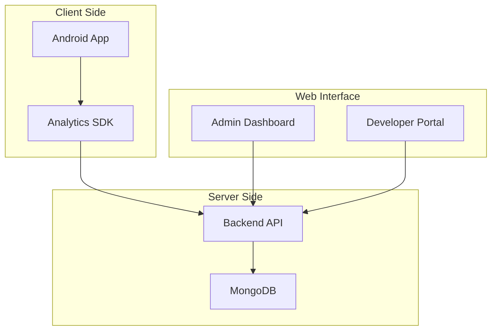

# 📚 UserAnalyticsSDK Documentation

Welcome to the comprehensive documentation for UserAnalyticsSDK - a complete analytics solution for Android applications.

## 📖 Table of Contents

### 🚀 Getting Started
- [Quick Start Guide](./getting-started/quick-start.md)
- [Installation](./getting-started/installation.md)
- [Configuration](./getting-started/configuration.md)

### 📱 Android SDK
- [SDK Integration Guide](./sdk/integration.md)
- [API Reference](./sdk/api-reference.md)
- [Code Examples](./sdk/examples.md)
- [Best Practices](./sdk/best-practices.md)

### 🖥️ Backend API
- [API Documentation](./api/endpoints.md)
- [Authentication](./api/authentication.md)
- [Error Handling](./api/errors.md)
- [Rate Limiting](./api/rate-limiting.md)

### 🎨 Admin Dashboard
- [Dashboard Guide](./dashboard/overview.md)
- [User Management](./dashboard/users.md)
- [Analytics Views](./dashboard/analytics.md)
- [Application Management](./dashboard/apps.md)

### 🚀 Deployment
- [Cloud Deployment](./deployment/cloud.md)
- [Environment Setup](./deployment/environment.md)
- [Docker Configuration](./deployment/docker.md)
- [Monitoring](./deployment/monitoring.md)

### 🔒 Security
- [Security Best Practices](./security/best-practices.md)
- [API Key Management](./security/api-keys.md)
- [Data Privacy](./security/privacy.md)

### 🛠️ Development
- [Contributing Guide](./development/contributing.md)
- [Code Style](./development/code-style.md)
- [Testing](./development/testing.md)
- [Debugging](./development/debugging.md)

## 🎯 Quick Links

| Component | Documentation | Live Demo |
|-----------|---------------|-----------|
| Android SDK | [Integration Guide](./sdk/integration.md) | [Example App](../app/) |
| Backend API | [API Docs](./api/endpoints.md) | [Swagger UI](#) |
| Admin Dashboard | [Dashboard Guide](./dashboard/overview.md) | [Live Demo](#) |

## 📊 Architecture Overview

## 🔧 System Requirements

### Development Environment
- **Android Studio**: 4.0+
- **Java**: 8+
- **Node.js**: 14+
- **MongoDB**: 4.4+
- **Git**: 2.0+

### Production Environment
- **Cloud Provider**: AWS, GCP, Azure, or Vercel
- **Database**: MongoDB Atlas
- **CDN**: CloudFlare (recommended)
- **SSL Certificate**: Required for HTTPS

## 📈 Performance Metrics

| Metric | Target | Current |
|--------|--------|---------|
| API Response Time | < 200ms | ~150ms |
| SDK Initialization | < 100ms | ~80ms |
| Dashboard Load Time | < 2s | ~1.5s |
| Data Processing | Real-time | ~5s delay |

## 🆘 Support

### Getting Help
- 📖 Check this documentation first
- 🐛 [Report bugs](https://github.com/nSella10/UserAnalyticsSDK/issues)
- 💬 [Discussions](https://github.com/nSella10/UserAnalyticsSDK/discussions)
- 📧 Email: support@useranalyticssdk.com

### Community
- 🌟 [GitHub Repository](https://github.com/nSella10/UserAnalyticsSDK)
- 📱 [Android Developers Community](https://developer.android.com/community)
- 🚀 [Spring Boot Community](https://spring.io/community)

## 📝 Changelog

### Version 1.0.0 (Current)
- ✅ Initial release
- ✅ Android SDK with event tracking
- ✅ Backend API with JWT authentication
- ✅ Admin dashboard with real-time analytics
- ✅ MongoDB integration
- ✅ Multi-language support (Hebrew/English)

### Upcoming Features
- 🔄 Offline event queuing
- 📊 Advanced analytics (funnels, cohorts)
- 🔔 Real-time notifications
- 📱 iOS SDK
- 🌐 Web SDK

---

**Last Updated**: January 2025  
**Version**: 1.0.0  
**Maintainer**: nSella10
